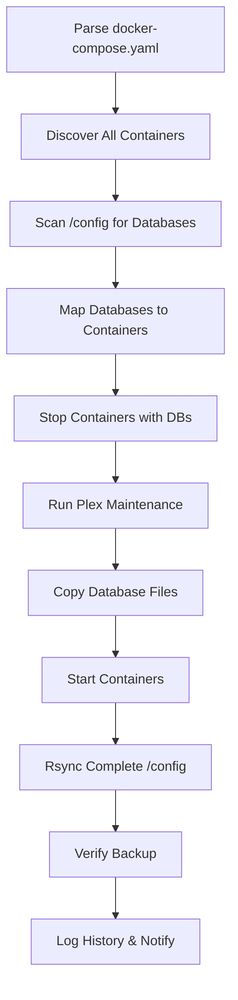

# Plex Multi-Container Backup Solution

[](https://github.com/keithah/plex-backup-container/actions/workflows/docker-build.yml)
[](https://github.com/keithah/plex-backup-container/actions/workflows/docker-security.yml)
[](https://github.com/keithah/plex-backup-container/actions/workflows/test.yml)

A production-ready Docker container that provides comprehensive backup functionality for Docker-based media server stacks. Automatically discovers containers, handles SQLite databases safely, and performs complete configuration backups.

## 🚀 Features

- **📋 Auto-Discovery**: Reads your `docker-compose.yaml` to discover containers and volume mappings
- **🗃️ Smart Database Handling**: Automatically finds and safely backs up all SQLite databases
- **🛠️ Plex Maintenance**: Integrated ChuckPa's DBRepair with trash emptying and corruption detection
- **💾 Complete Backup**: Backs up entire `/config` directory with intelligent exclusions
- **⏰ Scheduled Execution**: Configurable cron scheduling (default: daily at 2 AM)
- **🔄 Container Management**: Only stops containers that have databases requiring backup
- **📊 Comprehensive Logging**: Detailed timestamped logs with backup verification
- **🔐 Production Ready**: Lock files, space checking, timeout handling, and error recovery

## 🏗️ Architecture



## 🐳 Quick Start

### Using Pre-built Image

```bash
# Pull the latest image
docker pull ghcr.io/keithah/plex-backup-container:latest

# Create docker-compose.yml
curl -O https://raw.githubusercontent.com/keithah/plex-backup-container/main/docker-compose.yaml

# Configure environment variables
export HOSTNAME=$(hostname)

# Deploy
docker-compose up -d plex-backup
```

### Building from Source

```bash
git clone https://github.com/keithah/plex-backup-container.git
cd plex-backup-container

# Build and deploy
docker-compose build
docker-compose up -d plex-backup
```

## ⚙️ Configuration

### Environment Variables

| Variable | Default | Description |
|----------|---------|-------------|
| `HOSTNAME` | `$(hostname)` | Server identifier for backup organization |
| `CONFIG_BASE_PATH` | `/config` | Base configuration directory to backup |
| `COMPOSE_FILE` | `/config/docker-compose.yaml` | Path to docker-compose file for parsing |
| `NFS_SERVER` | `hadm.net` | NFS server hostname/IP |
| `NFS_PATH` | `/storage` | NFS export path |
| `BACKUP_SCHEDULE` | `0 2 * * *` | Cron schedule for automated backups |

### Docker Compose Example

```yaml
services:
  plex-backup:
    image: ghcr.io/keithah/plex-backup-container:latest
    container_name: plex-backup
    restart: unless-stopped
    privileged: true
    cap_add:
      - SYS_ADMIN
    environment:
      - HOSTNAME=${HOSTNAME}
      - CONFIG_BASE_PATH=/config
      - COMPOSE_FILE=/config/docker-compose.yaml
      - NFS_SERVER=your-nfs-server.com
      - NFS_PATH=/storage
    volumes:
      - /var/run/docker.sock:/var/run/docker.sock:ro
      - /config:/config:ro
      - ./logs:/var/log/backup
```

## 🎯 What Gets Backed Up

### Database Files (Copied while containers stopped)
- **Plex**: All SQLite databases + maintenance (trash empty, DBRepair)
- **Tautulli**: Statistics and monitoring database
- **Any Container**: Automatically discovers `*.db`, `*.sqlite`, `*.sqlite3` files

### Configuration Files (Rsync while running)
- **Complete `/config`**: All configuration files, certificates, settings
- **Smart Exclusions**: Excludes cache, logs, temporary files
- **Preserves Structure**: Maintains directory layout and permissions

## 🔄 Process Flow

1. **Discovery Phase**
   - Parse `docker-compose.yaml` for container-to-config mappings
   - Scan entire `/config` for database files
   - Map database files to their owning containers

2. **Database Backup Phase**
   - Stop only containers with databases (minimizes downtime)
   - Run Plex maintenance (trash empty + DBRepair)
   - Copy all database files with related WAL/SHM files
   - Start containers back up

3. **Complete Backup Phase**
   - Rsync entire `/config` directory
   - Exclude temporary/cache files
   - Verify backup integrity
   - Log history and send notifications

## 🚨 Troubleshooting

### Common Issues

```bash
# Check container status
docker-compose ps plex-backup

# View logs
docker logs plex-backup
tail -f logs/backup.log

# Manual backup test
docker exec plex-backup /scripts/backup-script.sh

# Check NFS connectivity
docker exec plex-backup mount | grep nfs
```

### Debug Mode

```bash
# Run with debug logging
docker exec plex-backup bash -x /scripts/backup-script.sh
```

## 📊 Monitoring

### Backup Verification
- Checks for critical Plex files (Preferences.xml, Metadata)
- Verifies database file counts
- Reports backup size and status

### History Tracking
```bash
# View backup history
cat /storage/backups/docker/.backup-history.csv

# Check recent backups
ls -la /storage/backups/docker/$HOSTNAME/
```

## 🔐 Security

- Container runs with minimal required privileges
- Read-only mounts for source directories
- Proper cleanup procedures on failure
- Regular security scanning via GitHub Actions

## 🤝 Contributing

1. Fork the repository
2. Create a feature branch
3. Make your changes
4. Run tests: `docker-compose build && docker-compose up test`
5. Submit a pull request

## 📄 License

This project is licensed under the MIT License - see the [LICENSE](LICENSE) file for details.

## 🙏 Acknowledgments

- **ChuckPa** for [PlexDBRepair](https://github.com/ChuckPa/PlexDBRepair)
- **LinuxServer.io** for excellent container images
- **Docker** and **Alpine Linux** teams

---

**⚠️ Production Note**: Always test backup and restore procedures in your environment before relying on this solution for critical data.