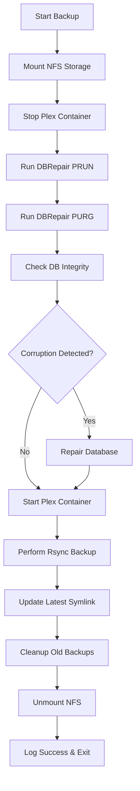

# Plex Docker Backup Container

[](https://opensource.org/licenses/MIT)
[](https://www.docker.com/)
[](https://alpinelinux.org/)

A production-ready Docker container that provides automated backup functionality for Plex Media Server with integrated database maintenance using ChuckPa's DBRepair tool. Designed for reliable, hands-off operation in Docker Compose stacks.

## 🚀 Key Features

- **🔄 Smart Container Management**: Automatically stops/starts Plex container for safe maintenance
- **🛠️ Database Optimization**: Integrates ChuckPa's DBRepair tool with PRUN/PURG operations
- **🔍 Corruption Detection**: Automatically detects and repairs SQLite database corruption
- **💾 NFS Integration**: Secure temporary mounting of network storage
- **📦 Incremental Backups**: Efficient rsync-based backups with intelligent file exclusions
- **⏰ Scheduled Execution**: Configurable cron scheduling (default: 2 AM daily)
- **🧹 Smart Cleanup**: Automatic resource cleanup and error recovery
- **📊 Comprehensive Logging**: Detailed timestamped logs for monitoring and debugging
- **🔐 Security First**: Read-only mounts, proper privilege separation, and cleanup procedures

## 📁 Project Structure

```
plex-backup-container/
├── 📄 Dockerfile                # Alpine-based container definition
├── 📜 backup-script.sh          # Core backup automation script
├── 🐳 docker-compose.yaml       # Complete stack orchestration
├── 🚫 .dockerignore            # Docker build exclusions
├── 🔧 setup.sh                 # Environment setup helper
├── 📖 README.md                # This documentation
└── ⚖️  LICENSE                  # MIT License
```

## ⚡ Quick Start

### Prerequisites
- Docker & Docker Compose installed
- NFS server accessible (default: `hadm.net:/storage`)
- Existing Plex container or willingness to deploy one
- Sufficient storage space for backups

### 1. Clone and Setup
```bash
git clone <your-private-repo-url>
cd plex-backup-container
chmod +x setup.sh backup-script.sh
./setup.sh
```

### 2. Configure Environment
Edit `docker-compose.yaml` environment variables:
```yaml
environment:
  - HOSTNAME=your-server-name
  - PLEX_CONTAINER=plex
  - NFS_SERVER=your-nfs-server.com
  - NFS_PATH=/your/nfs/path
```

### 3. Deploy Stack
```bash
# Create required directories
mkdir -p config logs homebridge

# Start the complete stack
docker-compose up -d

# Verify deployment
docker-compose ps
```

### 4. Test Backup
```bash
# Trigger manual backup
docker exec plex-backup /scripts/backup-script.sh

# Monitor progress
docker logs -f plex-backup
tail -f logs/backup.log
```

## ⚙️ Configuration

### Environment Variables

| Variable | Default | Description | Required |
|----------|---------|-------------|----------|
| `HOSTNAME` | `$(hostname)` | Server identifier for backup organization | ✅ |
| `BACKUP_SCHEDULE` | `0 2 * * *` | Cron schedule (daily 2 AM) | ❌ |
| `PLEX_CONTAINER` | `plex` | Target Plex container name | ✅ |
| `CONFIG_PATH` | `/config` | Plex configuration directory path | ✅ |
| `NFS_SERVER` | `hadm.net` | NFS server hostname/IP | ✅ |
| `NFS_PATH` | `/storage` | NFS export path | ✅ |
| `NFS_MOUNT` | `/mnt/nfs` | Container NFS mount point | ❌ |
| `BACKUP_PATH` | `/storage/backups/docker` | Backup destination path | ❌ |
| `NOTIFICATION_URL` | - | Optional webhook for backup notifications | ❌ |

### Custom Cron Schedules
```yaml
# Daily at 3:30 AM
- BACKUP_SCHEDULE=30 3 * * *

# Weekly on Sunday at 2:00 AM  
- BACKUP_SCHEDULE=0 2 * * 0

# Twice daily at 2 AM and 2 PM
- BACKUP_SCHEDULE=0 2,14 * * *
```

## 🔄 Backup Process Flow



### Database Maintenance Details
1. **PRUN Operation**: Removes unused database entries and optimizes storage
2. **PURG Operation**: Purges temporary and unnecessary database records  
3. **Integrity Check**: Verifies database consistency using SQLite PRAGMA
4. **Auto-Repair**: Automatically rebuilds corrupted databases when detected

### File Exclusion Strategy
The backup intelligently excludes:
- `Cache/` - Plex media cache files
- `Codecs/` - Downloaded codec files
- `Crash Reports/` - Application crash dumps
- `Diagnostics/` - Debug and diagnostic files
- `Logs/` - Application log files
- `Updates/` - Plex update files
- `*.tmp`, `*.lock` - Temporary and lock files
- `Plug-in Support/Caches/` - Plugin cache data

## 🛠️ Operations Guide

### Building the Container
```bash
# Build locally
docker build -t plex-backup:latest .

# Build with custom tag
docker build -t your-registry/plex-backup:v1.0 .
```

### Manual Operations
```bash
# Execute one-time backup
docker exec plex-backup /scripts/backup-script.sh

# View real-time logs
docker logs -f plex-backup

# Access container shell
docker exec -it plex-backup sh

# Check backup status
docker exec plex-backup ls -la /mnt/nfs/backups/docker/$HOSTNAME/
```

### Backup Management
```bash
# List all backups
docker exec plex-backup find /mnt/nfs/backups/docker/$HOSTNAME -type d -name "20*"

# Check backup sizes
docker exec plex-backup du -sh /mnt/nfs/backups/docker/$HOSTNAME/*

# Restore from backup (manual process)
# 1. Stop Plex container
# 2. Replace config directory with backup
# 3. Start Plex container
```

## 🔍 Monitoring & Troubleshooting

### Log Analysis
```bash
# View recent backup logs
tail -f logs/backup.log

# Search for errors
grep -i error logs/backup.log

# Check backup completion
grep -i "backup process completed" logs/backup.log
```

### Common Issues & Solutions

| Issue | Symptoms | Solution |
|-------|----------|----------|
| **NFS Mount Failure** | "Failed to mount NFS" in logs | Verify NFS server connectivity and export permissions |
| **Docker Access Denied** | "Cannot access Docker daemon" | Ensure `/var/run/docker.sock` is mounted and accessible |
| **Database Lock** | "database is locked" errors | Verify Plex container is fully stopped before maintenance |
| **Insufficient Space** | rsync failures, partial backups | Monitor NFS storage usage and cleanup old backups |
| **Permission Errors** | Container access failures | Check container runs with appropriate privileges |

### Health Checks
```bash
# Verify container status
docker-compose ps plex-backup

# Test NFS connectivity
docker exec plex-backup ping -c 3 hadm.net

# Check Docker API access  
docker exec plex-backup docker ps

# Validate backup integrity
docker exec plex-backup ls -la /mnt/nfs/backups/docker/$HOSTNAME/latest
```

## 🔐 Security Considerations

### Container Security
- **Privileged Mode**: Required for NFS mounting - runs with `--privileged`
- **Docker Socket**: Mounted read-only for container control
- **File Permissions**: Plex config mounted read-only for backup safety
- **Network Isolation**: Runs on isolated Docker network

### Data Protection
- **Incremental Backups**: Minimizes data transfer and storage usage
- **Atomic Operations**: Database operations are atomic to prevent corruption
- **Automatic Cleanup**: Ensures proper resource cleanup on failure
- **Error Recovery**: Comprehensive error handling and recovery procedures

## 🔧 Advanced Configuration

### Custom Docker Compose Integration
```yaml
version: '3.8'
services:
  plex:
    image: plexinc/pms-docker:latest
    # ... your existing Plex configuration
    
  plex-backup:
    build: .
    depends_on:
      - plex
    environment:
      - HOSTNAME=${HOSTNAME}
      - BACKUP_SCHEDULE=0 2 * * *
    volumes:
      - /var/run/docker.sock:/var/run/docker.sock:ro
      - ./plex-config:/config:ro
      - ./backup-logs:/var/log/backup
```

### Notification Integration
```bash
# Webhook notification example
export NOTIFICATION_URL="https://hooks.slack.com/services/YOUR/SLACK/WEBHOOK"

# Or Discord
export NOTIFICATION_URL="https://discord.com/api/webhooks/YOUR/DISCORD/WEBHOOK"
```

### Backup Retention Policies
Modify the cleanup section in `backup-script.sh`:
```bash
# Keep last 14 days instead of 7
find "$BACKUP_DIR" -maxdepth 1 -type d -name "20*" -mtime +14 -exec rm -rf {} \;

# Keep last 5 backups regardless of age
ls -1t "$BACKUP_DIR"/20* | tail -n +6 | xargs rm -rf
```

## 📊 Performance & Scaling

### Resource Requirements
- **CPU**: Low usage (spikes during backup operations)
- **RAM**: ~50MB base usage
- **Storage**: Backup size depends on Plex configuration
- **Network**: NFS bandwidth for backup transfers

### Optimization Tips
- Schedule backups during low-usage periods
- Use NFS with good network connectivity
- Monitor backup sizes and adjust retention policies
- Consider backup compression for long-term storage

## 🤝 Contributing

This is a private repository. For internal improvements:

1. Create a feature branch
2. Make your changes
3. Test thoroughly in development environment
4. Submit pull request with detailed description
5. Ensure all tests pass

## 📄 License

This project is licensed under the MIT License - see the [LICENSE](LICENSE) file for details.

## 🙏 Acknowledgments

- **ChuckPa** for the excellent [PlexDBRepair](https://github.com/ChuckPa/PlexDBRepair) tool
- **Plex Inc.** for Plex Media Server
- **Alpine Linux** team for the minimal, secure base image
- **Docker** community for containerization best practices

## 📞 Support

For issues, questions, or feature requests related to this backup solution, please create an issue in this repository.

---

**⚠️ Important**: This backup solution is designed for production use but should be thoroughly tested in your environment before deployment. Always verify backup integrity and test restoration procedures.